# Swin-LLIE: Illumination-Aware Swin Transformer for Low-Light Image Enhancement

## A Technical & Theoretical Deep Dive

---

## Abstract

**Swin-LLIE** presents a novel deep learning architecture that combines the powerful feature extraction capabilities of **Swin Transformers** with **illumination-aware attention mechanisms** for adaptive low-light image enhancement. The key contribution is the **Illumination-Guided Attention Module (IGAM)**, which modulates transformer features based on estimated local illumination levels, enabling region-adaptive enhancement that preserves well-lit areas while aggressively enhancing dark regions.

---

## Table of Contents

1. [Problem Formulation](#1-problem-formulation)
2. [Theoretical Foundations](#2-theoretical-foundations)
3. [Swin Transformer Architecture](#3-swin-transformer-architecture)
4. [Proposed Architecture: Swin-LLIE](#4-proposed-architecture-swin-llie)
5. [Novel Contributions](#5-novel-contributions)
6. [Loss Function Design](#6-loss-function-design)
7. [Comparison with Prior Work](#7-comparison-with-prior-work)
8. [Model Specifications](#8-model-specifications)

---

## 1. Problem Formulation

### 1.1 The Low-Light Image Enhancement Problem

Given a low-light image $I_{low} \in \mathbb{R}^{H \times W \times 3}$, the goal is to learn a mapping function $f_\theta$ that produces an enhanced image:

$$I_{enhanced} = f_\theta(I_{low})$$

such that $I_{enhanced}$ approximates the corresponding well-lit ground truth $I_{gt}$.

### 1.2 Challenges in Low-Light Enhancement

| Challenge | Description | Impact |
|-----------|-------------|--------|
| **Non-uniform illumination** | Different regions require different enhancement levels | Global methods fail |
| **Color distortion** | Low SNR causes color shifts in dark regions | Unrealistic outputs |
| **Noise amplification** | Enhancement amplifies sensor noise | Grainy artifacts |
| **Detail preservation** | Fine textures lost in very dark regions | Over-smoothing |
| **Structural consistency** | Must maintain spatial relationships | Object distortion |

### 1.3 Key Insight

The core insight of Swin-LLIE is that **enhancement should be spatially adaptive**:

$$\text{Enhancement Strength}(x,y) \propto \text{Darkness Level}(x,y)$$

This is achieved through the Illumination-Guided Attention Module (IGAM).

---

## 2. Theoretical Foundations

### 2.1 Retinex Theory

Swin-LLIE's illumination estimation is grounded in **Retinex theory** (Land & McCann, 1971), which models image formation as:

$$I(x,y) = R(x,y) \cdot L(x,y)$$

Where:
- $I(x,y)$: Observed image intensity
- $R(x,y)$: **Reflectance** (intrinsic surface properties, illumination-invariant)
- $L(x,y)$: **Illumination** (incident light, spatially varying)

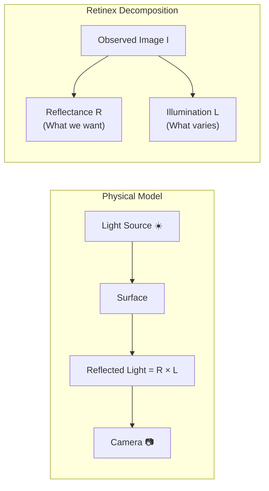

**Retinex-based Enhancement Strategy**:
1. Estimate $L$ from $I$
2. Compute enhanced illumination $\hat{L}$ (brighter, smoother)
3. Reconstruct: $\hat{I} = R \cdot \hat{L} = \frac{I}{L} \cdot \hat{L}$

### 2.2 Approximating Illumination

In Swin-LLIE, illumination is approximated using the **max-RGB channel**:

$$L_{rough}(x,y) = \max_{c \in \{R,G,B\}} I_c(x,y)$$

This is based on the observation that the brightest channel provides a reasonable illumination proxy. The rough estimate is then refined by a learned CNN.

### 2.3 Self-Attention Mechanism

The transformer's self-attention allows modeling **long-range dependencies**:

$$\text{Attention}(Q, K, V) = \text{softmax}\left(\frac{QK^T}{\sqrt{d_k}}\right)V$$

Where:
- $Q, K, V \in \mathbb{R}^{N \times d}$: Query, Key, Value matrices
- $N$: Sequence length (number of tokens/patches)
- $d_k$: Key dimension
- $\frac{1}{\sqrt{d_k}}$: Scaling factor for numerical stability

**Why Self-Attention for Low-Light Enhancement?**

| Property | Benefit for Enhancement |
|----------|------------------------|
| **Global receptive field** | Can reference well-lit regions to enhance dark ones |
| **Content-adaptive** | Different enhancement for different textures |
| **Permutation equivariant** | Consistent processing regardless of position |

---

## 3. Swin Transformer Architecture

### 3.1 From ViT to Swin: Addressing Computational Complexity

**Vision Transformer (ViT)** applies global self-attention:
- Complexity: $O(N^2)$ where $N = H \times W$
- For a 256×256 image: 65,536² = 4.3 billion operations per layer

**Swin Transformer** introduces **windowed attention**:
- Divide image into $M \times M$ windows (typically $M = 8$)
- Apply self-attention **within** each window
- Complexity: $O(M^2 \cdot N) = O(N)$ — **linear** in image size!

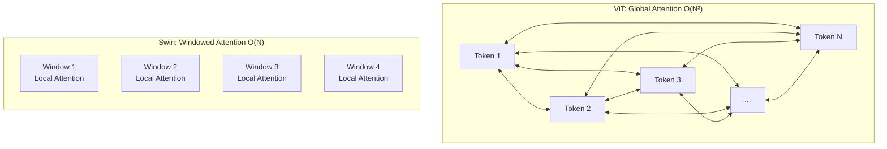

### 3.2 The Shifted Window Mechanism

**Problem**: Windowed attention has **no cross-window communication**.

**Solution**: Alternate between Regular Windows (W-MSA) and Shifted Windows (SW-MSA).

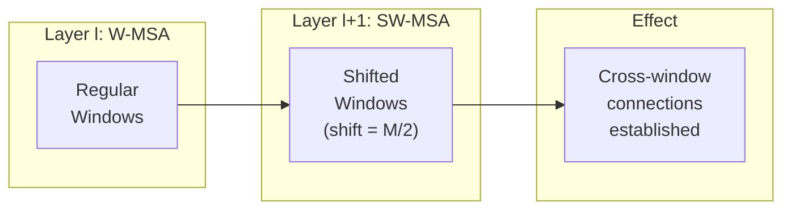

**Mathematical Formulation**:

For consecutive Swin Transformer blocks:

$$\hat{z}^l = \text{W-MSA}(\text{LN}(z^{l-1})) + z^{l-1}$$
$$z^l = \text{MLP}(\text{LN}(\hat{z}^l)) + \hat{z}^l$$
$$\hat{z}^{l+1} = \text{SW-MSA}(\text{LN}(z^l)) + z^l$$
$$z^{l+1} = \text{MLP}(\text{LN}(\hat{z}^{l+1})) + \hat{z}^{l+1}$$

### 3.3 Relative Position Bias

Unlike absolute position embeddings, Swin uses **relative position bias**:

$$\text{Attention}(Q, K, V) = \text{softmax}\left(\frac{QK^T}{\sqrt{d_k}} + B\right)V$$

Where $B \in \mathbb{R}^{M^2 \times M^2}$ is the relative position bias matrix.

**Advantages**:
- Better generalization to different image sizes
- Captures spatial relationships within windows
- Fewer parameters than absolute embeddings

### 3.4 Hierarchical Feature Representation

Swin Transformer builds **hierarchical features** through patch merging:

```
Stage 1: H×W resolution,    C channels
    ↓ Patch Merge (2×2 → 1)
Stage 2: H/2×W/2 resolution, 2C channels
    ↓ Patch Merge
Stage 3: H/4×W/4 resolution, 4C channels
    ↓ Patch Merge
Stage 4: H/8×W/8 resolution, 8C channels
```

This creates a **feature pyramid** similar to CNNs (ResNet, VGG), enabling multi-scale understanding.

---

## 4. Proposed Architecture: Swin-LLIE

### 4.1 Overall Architecture

Swin-LLIE adopts a **U-Net structure** with Swin Transformer blocks:

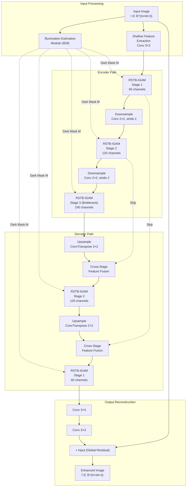

### 4.2 Design Rationale

| Design Choice | Rationale |
|---------------|-----------|
| **U-Net structure** | Enables multi-scale processing; captures both fine details and global context |
| **Skip connections** | Preserves high-frequency details that may be lost during downsampling |
| **Global residual learning** | Easier to learn residual (difference) than full mapping; stabilizes training |
| **3-stage hierarchy** | Balances computational cost with sufficient receptive field growth |
| **IGAM at every stage** | Ensures illumination-aware processing at all resolution levels |

### 4.3 Residual Learning Framework

Instead of directly learning $f(I_{low}) = I_{gt}$, we learn the **residual**:

$$\hat{I} = I_{low} + f_{residual}(I_{low})$$

**Why Residual Learning?**

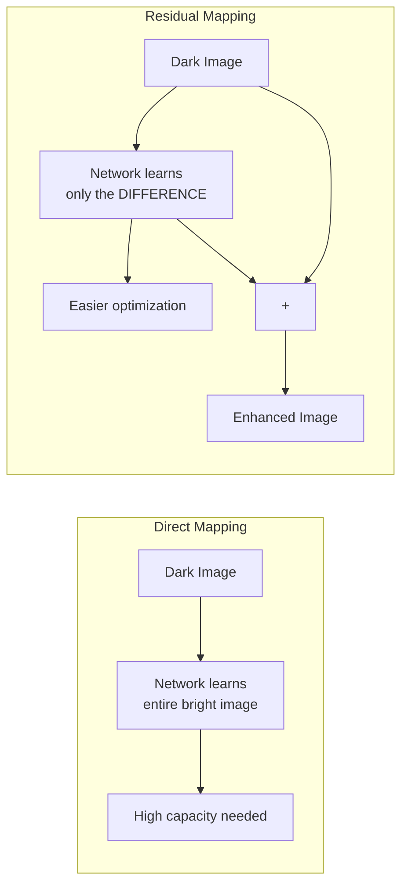

**Mathematical Justification**: 

If $I_{gt} \approx I_{low}$ in bright regions, then:
$$f_{residual}(I_{low}) \approx 0 \text{ (bright regions)}$$
$$f_{residual}(I_{low}) \approx I_{gt} - I_{low} \text{ (dark regions)}$$

This is a **sparser** target, easier to learn.

---

## 5. Novel Contributions

### 5.1 Illumination Estimation Module (IEM)

**Purpose**: Estimate per-pixel illumination levels to identify dark regions.

**Architecture**:

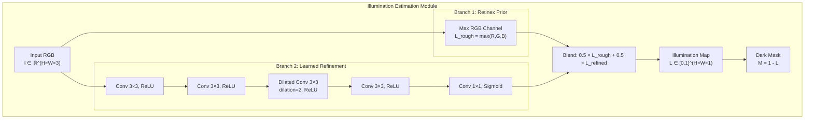

**Key Design Decisions**:

1. **Dual-branch approach**: Combines physics-based prior (max-RGB) with learned refinement
2. **Dilated convolution**: Increases receptive field for illumination coherence
3. **Inversion to dark mask**: $M = 1 - L$ makes dark regions have high values, convenient for modulation

### 5.2 Illumination-Guided Attention Module (IGAM)

**This is the core contribution of Swin-LLIE.**

**Mathematical Formulation**:

$$F_{out} = F_{in} \odot (1 + \alpha \odot M')$$

Where:
- $F_{in} \in \mathbb{R}^{C \times H \times W}$: Input features
- $\alpha \in \mathbb{R}^{C \times 1 \times 1}$: Channel-wise adaptive scaling (learned)
- $M' \in \mathbb{R}^{1 \times H \times W}$: Spatially refined dark mask
- $\odot$: Element-wise multiplication (with broadcasting)

**Analysis of the Modulation Function**:

$$\text{Modulation}(M) = 1 + \alpha \cdot M$$

| Dark Mask Value | Modulation | Effect |
|-----------------|------------|--------|
| $M = 0$ (bright) | $1 + 0 = 1.0$ | Features unchanged |
| $M = 0.5$ (medium) | $1 + 0.25 = 1.25$ | Moderate amplification |
| $M = 1$ (dark) | $1 + 0.5 = 1.5$ | Strong amplification |

(Assuming $\alpha = 0.5$ base value)

**Architecture Details**:

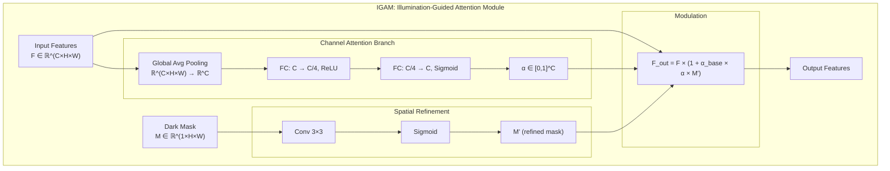

**Why This Design Works**:

1. **Multiplicative modulation** (vs. additive): 
   - Multiplicative: $F_{out} = F_{in} \cdot M$ — scales features proportionally
   - Additive: $F_{out} = F_{in} + M$ — shifts features absolutely
   - Multiplicative better preserves feature statistics

2. **Channel-wise adaptation** ($\alpha$):
   - Different channels encode different information (edges, textures, colors)
   - Some channels may need more illumination-based modulation than others

3. **Spatial refinement** ($M \rightarrow M'$):
   - Dark mask from IEM may be noisy
   - Conv layer learns to smooth/refine based on feature context

### 5.3 RSTB-IGAM: Residual Swin Transformer Block with IGAM

**Structure**:

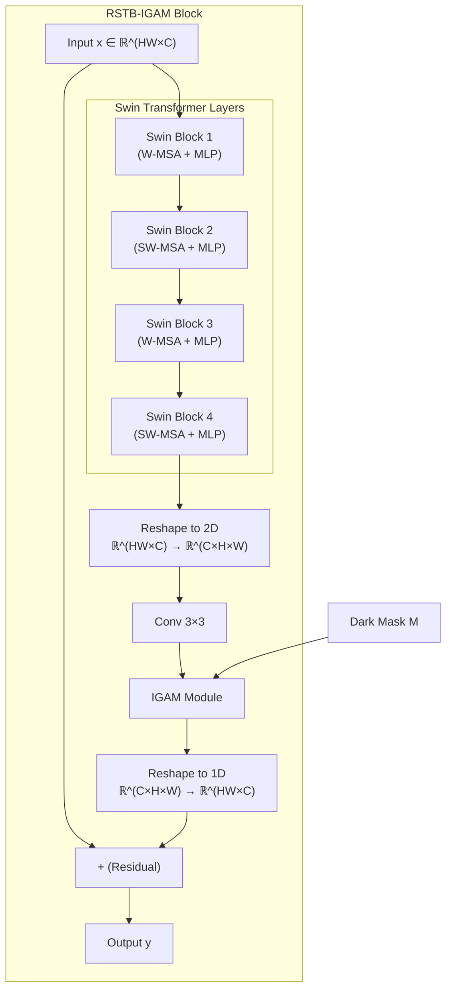

**Formulation**:

$$\text{RSTB-IGAM}(x; M) = x + \phi_{embed}(\text{IGAM}(\phi_{conv}(\phi_{Swin}(x)); M))$$

Where:
- $\phi_{Swin}$: Stack of 4 Swin Transformer blocks
- $\phi_{conv}$: Residual convolution
- $\text{IGAM}$: Illumination-guided modulation
- $\phi_{embed}$: Reshape operation

### 5.4 Cross-Stage Feature Fusion (CSFF)

**Purpose**: Intelligently combine encoder and decoder features at skip connections.

**Problem with Simple Skip Connections**:
- Simple addition: $F_{dec} = F_{up} + F_{enc}$ treats both equally
- Simple concatenation: doubles channel dimension, computationally expensive

**CSFF Solution**: Learned gating mechanism

$$F_{out} = g \odot F_{enc} + (1-g) \odot F_{dec} + \phi_{fuse}([F_{enc}; F_{dec}])$$

Where:
- $g \in [0,1]^{C \times 1 \times 1}$: Learned gate (sigmoid output)
- $\phi_{fuse}$: Fusion convolutions

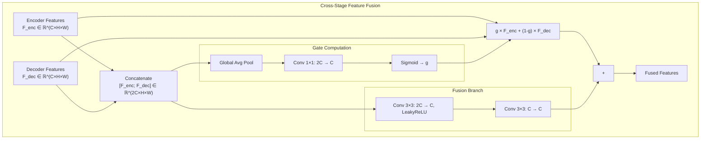

---

## 6. Loss Function Design

### 6.1 Hybrid Loss Formulation

$$\mathcal{L}_{total} = \lambda_1 \mathcal{L}_{L1} + \lambda_2 \mathcal{L}_{VGG} + \lambda_3 \mathcal{L}_{color} + \lambda_4 \mathcal{L}_{smooth}$$

**Default Weights**:
| Loss | Weight | Rationale |
|------|--------|-----------|
| $\mathcal{L}_{L1}$ | 1.0 | Primary reconstruction signal |
| $\mathcal{L}_{VGG}$ | 0.1 | Perceptual quality (lower weight to avoid over-smoothing) |
| $\mathcal{L}_{color}$ | 0.5 | Color preservation (critical for low-light) |
| $\mathcal{L}_{smooth}$ | 0.01 | Regularization (small weight) |

### 6.2 L1 Reconstruction Loss

$$\mathcal{L}_{L1} = \frac{1}{N} \sum_{i=1}^{N} |\hat{I}_i - I_{gt,i}|$$

**Properties**:
- Robust to outliers (compared to L2)
- Preserves edges (no over-smoothing)
- Directly optimizes PSNR metric

### 6.3 VGG Perceptual Loss

$$\mathcal{L}_{VGG} = \sum_{l \in \mathcal{L}} \|\phi_l(\hat{I}) - \phi_l(I_{gt})\|_2^2$$

Where $\phi_l$ denotes VGG19 features at layer $l$.

**Feature Layers Used**: {3, 8, 15, 22} corresponding to:

| Layer | Feature Type | What It Captures |
|-------|-------------|------------------|
| 3 | Low-level | Edges, simple patterns |
| 8 | Low-mid | Color blobs, basic textures |
| 15 | Mid-level | Complex textures, repeated patterns |
| 22 | High-level | Semantic content, object parts |

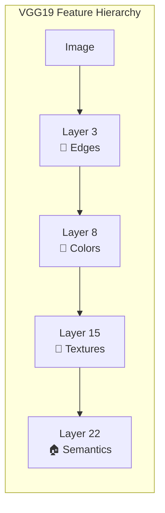

**Why Perceptual Loss?**

L1/L2 losses suffer from the **regression-to-mean problem**:
- When multiple outputs are plausible, L1/L2 averages them → blurry result
- Perceptual loss enforces **structural similarity** in feature space

### 6.4 Color Consistency Loss

$$\mathcal{L}_{color} = 1 - \frac{1}{HW} \sum_{h,w} \frac{\hat{I}_{h,w} \cdot I_{gt,h,w}}{\|\hat{I}_{h,w}\| \|\I_{gt,h,w}\| + \epsilon}$$

This is **1 minus cosine similarity** computed per-pixel across channels.

**Intuition**:
- Cosine similarity measures the **angle** between RGB vectors
- Two colors with different intensities but same hue have high cosine similarity
- Prevents the common **desaturation problem** in transformers

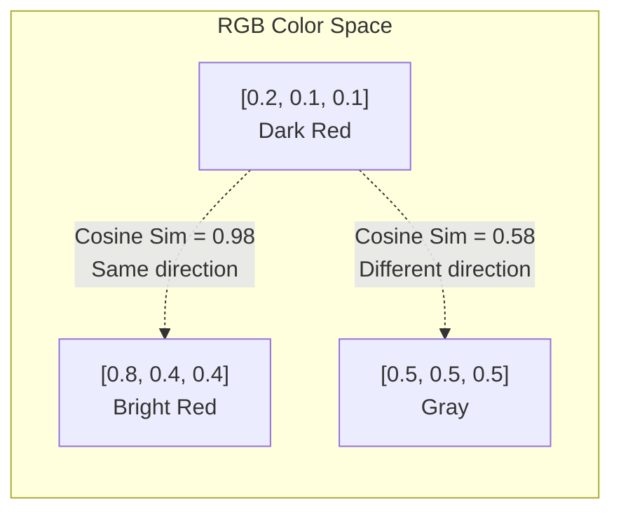

### 6.5 Illumination Smoothness Loss (Total Variation)

$$\mathcal{L}_{smooth} = \|\nabla_x L\|_1 + \|\nabla_y L\|_1$$

Where $\nabla_x, \nabla_y$ are horizontal and vertical gradient operators.

**Purpose**: Regularize the illumination map to be spatially smooth:
- Illumination typically varies smoothly in natural scenes
- Prevents the IEM from learning noisy patterns
- Acts as a prior on the illumination estimation

---

## 7. Comparison with Prior Work

### 7.1 Classical Methods

| Method | Approach | Limitations |
|--------|----------|-------------|
| **Histogram Equalization** | Global contrast stretching | Non-adaptive, amplifies noise |
| **CLAHE** | Local adaptive histogram | Block artifacts, no learning |
| **Retinex (SSR, MSR)** | Illumination estimation + removal | Halo artifacts, color shifts |
| **Gamma Correction** | Nonlinear intensity mapping | Content-unaware |

### 7.2 Deep Learning Methods

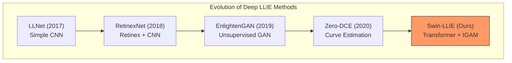

### 7.3 Comparison Table

| Method | Backbone | Illumination-Aware | Multi-Scale | Attention Type |
|--------|----------|-------------------|-------------|----------------|
| RetinexNet | CNN | ✓ (decomposition) | ✗ | None |
| EnlightenGAN | U-Net + GAN | ✗ | ✓ | Self-attention |
| Zero-DCE | Lightweight CNN | ✓ (curves) | ✗ | None |
| KinD | CNN | ✓ (decomposition) | ✓ | None |
| **Swin-LLIE** | **Swin Transformer** | **✓ (IGAM)** | **✓ (U-Net)** | **IGAM + W-MSA/SW-MSA** |

### 7.4 Key Differences

**vs. CNN-based Methods**:
- CNNs have limited receptive field → miss global context
- Swin captures long-range dependencies → better structural understanding

**vs. Standard Vision Transformers**:
- ViT is $O(N^2)$ complexity → impractical for high-res images
- Swin is $O(N)$ → efficient processing

**vs. Other Illumination-Aware Methods**:
- RetinexNet requires explicit decomposition → error propagation
- Swin-LLIE uses IGAM for soft guidance → more robust

---

## 8. Model Specifications

### 8.1 Architecture Parameters

| Component | Specification |
|-----------|---------------|
| Input size | Any (padded to multiples of window size) |
| Embedding dimension | 60 |
| Number of stages | 3 (encoder) + 2 (decoder) |
| Depths per stage | [4, 4, 4] Swin blocks |
| Attention heads per stage | [6, 6, 6] |
| Window size | 8 × 8 |
| MLP ratio | 2 |
| **Total parameters** | **~4.8 million** |

### 8.2 Computational Complexity Analysis

For input size $H \times W$:

| Component | Complexity |
|-----------|------------|
| IEM (5-layer CNN) | $O(HW)$ |
| W-MSA per layer | $O(M^2 \cdot HW)$ where $M=8$ |
| IGAM per block | $O(C + HW)$ |
| Total | $O(HW)$ — **linear in image size** |

### 8.3 Training Configuration

| Hyperparameter | Value |
|----------------|-------|
| Optimizer | AdamW |
| Learning rate | $2 \times 10^{-4}$ |
| Weight decay | $1 \times 10^{-4}$ |
| Batch size | 4 |
| Patch size (random crop) | 96 × 96 |
| Training epochs | 100 |
| LR scheduler | Cosine annealing |
| Warmup epochs | 5 |

---

## Summary

Swin-LLIE introduces a principled approach to low-light image enhancement by:

1. **Leveraging Swin Transformers** for efficient global context modeling
2. **Estimating illumination** using Retinex-inspired methods
3. **Guiding enhancement adaptively** through the novel IGAM module
4. **Preserving details** via U-Net architecture with cross-stage fusion
5. **Training with hybrid losses** that balance reconstruction, perception, and color

The key insight is that **spatially-adaptive enhancement**, informed by estimated illumination, produces more natural results than uniform global enhancement.

---

## References

1. Liu, Z., et al. (2021). "Swin Transformer: Hierarchical Vision Transformer using Shifted Windows." *ICCV 2021*.

2. Liang, J., et al. (2021). "SwinIR: Image Restoration Using Swin Transformer." *ICCV Workshops 2021*.

3. Land, E. H., & McCann, J. J. (1971). "Lightness and Retinex Theory." *Journal of the Optical Society of America*.

4. Wei, C., et al. (2018). "Deep Retinex Decomposition for Low-Light Enhancement." *BMVC 2018*.

5. Guo, C., et al. (2020). "Zero-Reference Deep Curve Estimation for Low-Light Image Enhancement." *CVPR 2020*.

6. Jiang, Y., et al. (2019). "EnlightenGAN: Deep Light Enhancement without Paired Supervision." *IEEE TIP*.
